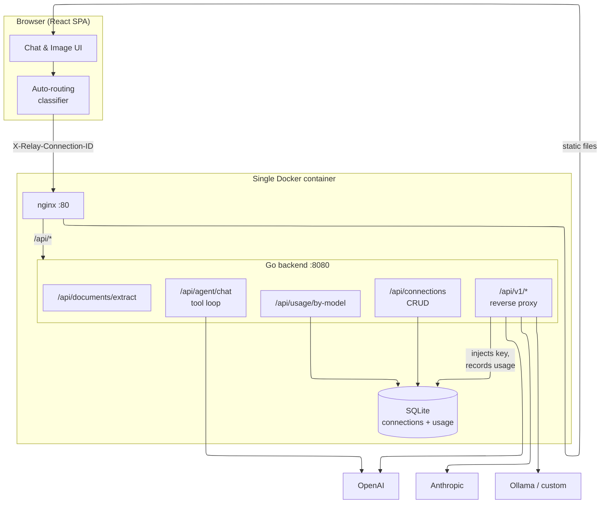

# Relay

A self-hosted AI chat and image-generation interface that proxies any OpenAI-compatible API, including OpenAI, Anthropic, Ollama, or your own endpoint. Think of it like open-webui or LibreChat, but lighter and easier to deploy.

## Features

- **Multiple connections.** Add as many API backends as you want (OpenAI, Ollama, Anthropic, or anything custom) and switch between them per chat.
- **Smart model routing.** Turn on auto-routing and a classifier reads each prompt, sorts it into a category (coding, creative, reasoning, or fast), and sends it to the model you picked for that category. Because every category can point at a different connection, a single conversation can lean on different providers depending on what you ask. More on this below.
- **Chat.** Streaming and non-streaming completions with full conversation history, editing, and regeneration.
- **Image generation.** Works with `gpt-image-1`, `dall-e-3`, and `dall-e-2`, with controls that adapt to whichever model you select.
- **Usage tracking.** Token usage is recorded per connection and per model in a local SQLite database, so you can see what you are spending.
- **Prompt library.** Save prompts you reach for often and reuse them in a click.
- **One Docker image.** The Go backend and React frontend ship together, served by nginx in a single container.

## How model routing works

The old behavior forced every message in a conversation to a single model. Auto-routing replaces that with categories.

You set up four slots in Settings, and each slot points at a model on any of your connections:

- **Fast** for short questions and simple tasks. This model also acts as the classifier.
- **Coding** for writing, debugging, and refactoring code.
- **Creative** for writing, brainstorming, and anything about tone.
- **Reasoning** for math, logic, and multi-step problems.

When you send a message, Relay first does a quick local keyword check to catch the obvious cases for free. If the prompt is ambiguous, it asks the Fast model to classify it, then routes the message to the matching slot's model and connection. If the classifier is unreachable or times out, it falls back to whatever you configured, either the conversation's own model or the Fast slot. Each reply shows a small badge so you can see which category handled it.

None of this needs special provider support. Routing just decides which connection to use, and the backend handles the actual switch.

## Getting started

### Option 1: Docker (recommended)

You need Docker installed.

```bash
docker run -d \
  -p 3000:80 \
  -e API_BASE_URL=https://api.openai.com \
  -e API_KEY=sk-... \
  -v relay_data:/data \
  --name relay \
  ghcr.io/johnbetancur/relay:latest
```

Then open [http://localhost:3000](http://localhost:3000).

### Option 2: Docker Compose

```bash
git clone https://github.com/johnbetancur/relay.git
cd relay

cp .env.example .env
# Set API_BASE_URL and API_KEY in .env

docker compose up -d
```

The app runs at [http://localhost:3000](http://localhost:3000).

### Option 3: Local development

You need Go 1.26 or newer and Node.js 22 or newer.

```bash
git clone https://github.com/johnbetancur/relay.git
cd relay

# Start the backend
cd backend
API_BASE_URL=https://api.openai.com API_KEY=sk-... go run ./cmd/server

# In another terminal, start the frontend
cd frontend
npm install
npm run dev
```

Frontend runs at [http://localhost:5173](http://localhost:5173) and the backend at [http://localhost:8080](http://localhost:8080).

You can also use Docker Compose with the `dev` profile to get hot-reload on both:

```bash
API_BASE_URL=https://api.openai.com API_KEY=sk-... \
  docker compose --profile dev up
```

## Configuration

Everything is configured through environment variables.

| Variable | Default | Description |
|---|---|---|
| `API_BASE_URL` | `https://api.openai.com` | Base URL of the upstream API |
| `API_KEY` | _(empty)_ | API key sent as `Authorization: Bearer` |
| `PORT` | `8080` | Port the Go backend listens on |
| `DB_PATH` | `./relay.db` | Path to the SQLite database file |

When you run with Docker, keep the database around by mounting a volume to `/data` and leaving `DB_PATH` at its default (`/data/vision.db` in `docker-compose.yml`).

## Connections

Relay supports multiple upstream connections, all managed from the UI under Settings then Connections. Each connection has:

| Field | Description |
|---|---|
| **Name** | Display label |
| **Base URL** | Upstream API root, for example `https://api.openai.com` or `http://localhost:11434` |
| **API Key** | Optional, sent as `Authorization: Bearer <key>` |
| **Type** | Hint for the UI: `openai`, `anthropic`, `ollama`, or `custom` |
| **Default** | Whether this connection is pre-selected in new chats |

The connection you set through the `API_BASE_URL` and `API_KEY` environment variables is the built-in fallback, used when no connection is selected.

### Provider examples

**OpenAI**
```
Base URL: https://api.openai.com
API Key:  sk-...
Type:     openai
```

**Anthropic**
```
Base URL: https://api.anthropic.com
API Key:  sk-ant-...
Type:     anthropic
```

**Ollama (local)**
```
Base URL: http://localhost:11434
API Key:  (leave empty)
Type:     ollama
```

**Any OpenAI-compatible API**
```
Base URL: https://your-provider.com/v1
API Key:  your-key
Type:     custom
```

## Image generation

The image page supports three model families and adjusts its controls for whichever you pick:

| Model | Sizes | Quality options | Style | Multi-image |
|---|---|---|---|---|
| `gpt-image-1` | 1024x1024, 1536x1024, 1024x1536 | auto / high / medium / low | n/a | yes (up to 4) |
| `dall-e-3` | 1024x1024, 1792x1024, 1024x1792 | hd / standard | vivid / natural | no (n=1 only) |
| `dall-e-2` | 1024x1024, 512x512, 256x256 | standard | n/a | yes (up to 4) |

Switching models resets quality, size, and count to valid defaults for that model.

## Architecture

The backend is not just a passthrough. It holds your API keys server-side, sidesteps the CORS restrictions that would block a browser from calling providers directly, records token usage, and runs the tool-calling and document-extraction endpoints. Routing happens entirely in the frontend: it decides which connection a request should use and sets the `X-Relay-Connection-ID` header. The proxy reads that header, swaps in the right upstream URL and key, and forwards the call.



- **Frontend:** React 19, Vite, Mantine UI, and Zustand.
- **Backend:** Go with the Chi router, and SQLite through modernc/sqlite, so there is no CGO requirement.
- **Deployment:** a single multi-stage Docker image. nginx serves the SPA and proxies `/api/*` to the Go process running alongside it in the same container.

## API

The backend exposes a small REST API for managing connections, querying usage, and the proxy itself.

### Connections

```
GET    /api/connections             List all connections
POST   /api/connections             Create a connection
GET    /api/connections/{id}        Get a connection
PUT    /api/connections/{id}        Update a connection
DELETE /api/connections/{id}        Delete a connection
GET    /api/connections/{id}/models List models for a connection
GET    /api/connections/{id}/stats  Usage stats for a connection
DELETE /api/connections/{id}/stats  Reset stats for a connection
```

**Connection object**

```json
{
  "id": "01J...",
  "name": "OpenAI",
  "baseUrl": "https://api.openai.com",
  "typeHint": "openai",
  "enabled": true,
  "isDefault": true,
  "createdAt": 1716000000,
  "updatedAt": 1716000000
}
```

> `apiKey` is write-only. It is accepted on create and update, but never returned.

### Usage

```
GET /api/usage/by-model    Token usage totals grouped by model
```

### Agent and documents

```
POST /api/agent/chat        Tool-calling chat (streams tool steps then the answer)
POST /api/documents/extract Extract text from an uploaded file (PDFs are parsed)
```

### Proxy

Every request to `/api/v1/*` is forwarded to the upstream API with the path rewritten to `/v1/*`. Pass `X-Relay-Connection-ID: <id>` to route the request through a specific connection.

### Health

```
GET /healthz    Returns 200 OK when the backend is up
```

## Building from source

```bash
# Frontend
cd frontend && npm ci && npm run build

# Backend
cd backend && go build -o relay ./cmd/server

# Or build the Docker image
docker build -t relay .
```

## License

Apache 2.0. See [LICENSE](LICENSE).
